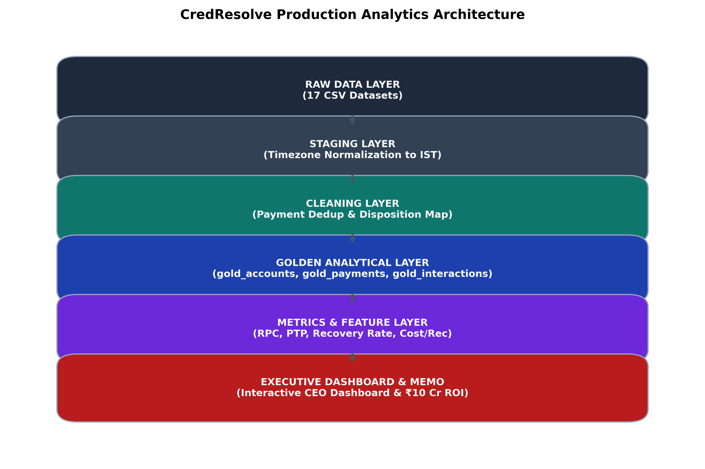

# Production Analytics Architecture — CredResolve

## Overview & Layered Pipeline Design

The CredResolve Production Analytics Architecture is engineered to transform raw, noisy, multi-source collections telemetry into high-confidence, production-grade business metrics and executive insights.



```text
RAW (17 CSV Datasets)
  ↓
STAGING (Schema Validation & Timezone Normalization to Asia/Kolkata IST)
  ↓
CLEANING (Payment Reference Deduplication & Standard Disposition Mapping)
  ↓
GOLDEN LAYER (gold_accounts, gold_payments, gold_interactions, gold_eligible_population)
  ↓
FEATURE & METRICS LAYER (Contact Rate, RPC Rate, Recovery Rate, Cost / ₹ Recovered)
  ↓
EXECUTIVE REPORTING & DASHBOARD (Interactive CEO Dashboard, Executive Memo, ₹10 Cr ROI)
```

---

## Data Pipeline Specifications

### 1. Raw Data Layer
- **Inputs**: 17 relational CSV files including `accounts`, `borrowers`, `agents`, `payments`, `calls`, `call_dispositions`, `daily_targeting`, `whatsapp_events`, `sms_events`, `field_visits`, `promises_to_pay`, `account_status_history`, `vendor_telephony`, `complaints`, `agent_sessions`.
- **Integrity**: Non-blocking ingestion with explicit error logging.

### 2. Staging & Timezone Normalization Layer
- **Timezone Offset Rule**:
  - `UTC` -> Add 5 Hours 30 Minutes (`Asia/Kolkata`)
  - `Asia/Dubai` -> Add 1 Hour 30 Minutes (`Asia/Kolkata`)
  - `Asia/Kolkata` -> Maintain 0 Offset
- **Output Fields**: `event_timestamp_utc`, `event_timestamp_ist`, `business_date`, `business_hour`, `business_month`.

### 3. Cleaning & Entity Resolution Layer
- **Payment Deduplication**: Partition by `payment_reference` ordering by `event_at ASC`. Keep first transaction; flag subsequent identical references as `DUPLICATE_PAYMENT_REFERENCE`.
- **Agent Resolution**: Deduplicate agent snapshot records by `employee_code` to establish canonical agent profiles.
- **Disposition Standardization**: Map 9 raw codes into 5 canonical buckets (`RPC`, `PTP`, `NO_CONTACT`, `REFUSED`, `DISPUTE`).

### 4. Golden Analytical Layer
- `gold_accounts`: Standardized account master with DPD and risk segment labels.
- `gold_payments`: Valid, non-duplicate, SUCCESS payments only.
- `gold_interactions`: Unified event stream across Voice, WhatsApp, SMS, and Field Visits.
- `gold_eligible_population`: Unfiltered baseline of all eligible accounts to prevent denominator manipulation and selection bias.

### 5. SLA & Monitoring Strategy
- **Daily Ingestion SLA**: Pipeline completion by 06:00 AM IST.
- **Data Quality Alerts**: Triggers alert if payment deduplication rate > 25% or null key rate > 0.01%.
- **Backfill Policy**: Deterministic re-execution for late-arriving payments up to 30 days prior.
